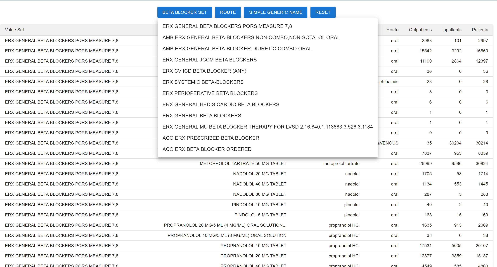
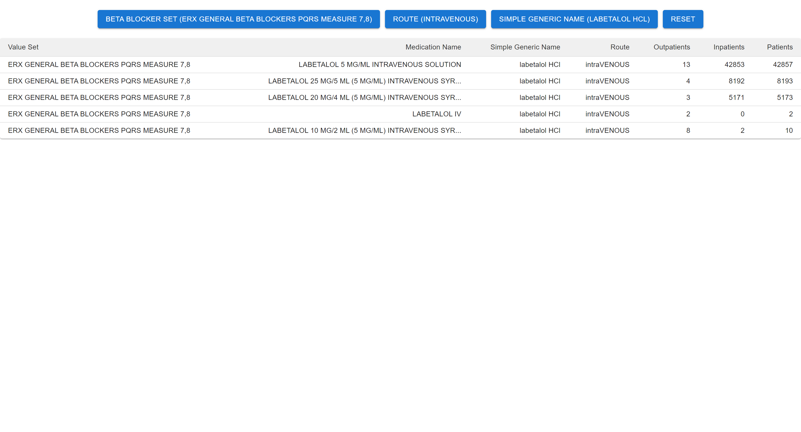

# Beta Blocker Filter Tool

This is a program to view, filter, and differ various Beta Blocker Value Sets.

## How to Run
Enter the "/server" folder and run the following command
```bash
flask run
```
Enter the "/client" folder and run the following command
```bash
npm start
```

## Write Up
Architectural Design Decisions: I decided to start by using Pandas to format the .csv files so that it would be presented in a way that would allow me to filter through it, and after this was completed, I set up an endpoint using Flask, so that the frontend could grab the data. I then decided to build the frontend in React, using a TypeScript template. This allows for easy styling and use of components, giving me more freedom. This also made it easy to create functions that would filter through the data.

Extensions to Add Usability: Possible additions could be a search bar so that if a user is looking for something specific, they can simply search for said item. Another addition would be styling to make the table more appealing to the eye.

Time Committed: This project took me about 5-6 hours in total to complete.

AI Tools Utilized: I used ChatGPT to assist me in debugging and styling the table, and I also used it to assist with some of the filtering.

## Video Demo
[Click Here to Watch](https://us05web.zoom.us/clips/share/YbXpuq253wASKf5wxjUPvEmnYvWB2Sm80PspaXketv-_Q1eM3mnZmxHsaH3YA2EWpANUrZgq8TCgMc72BYEh1dzsRA.OOxK-pyLPBY48Yzs)

## Example Run




